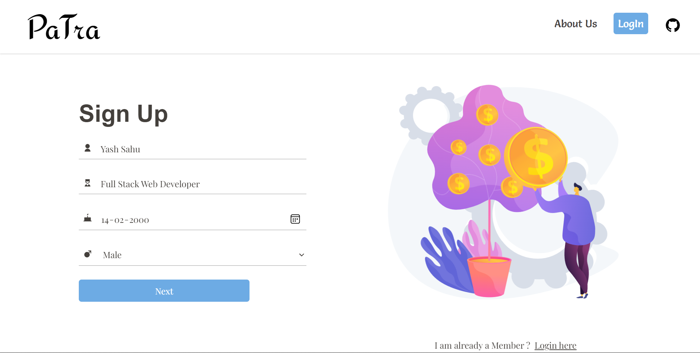
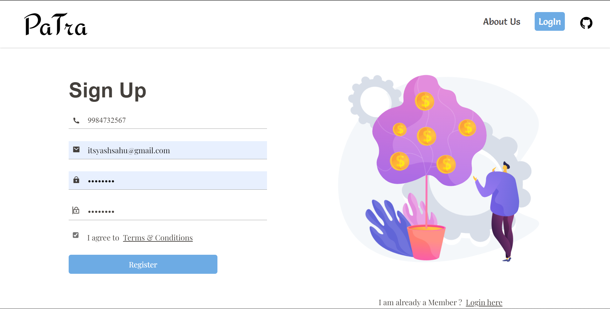
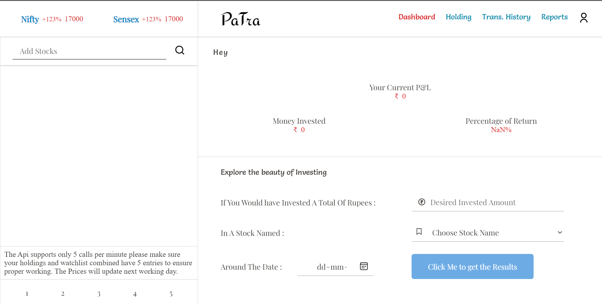
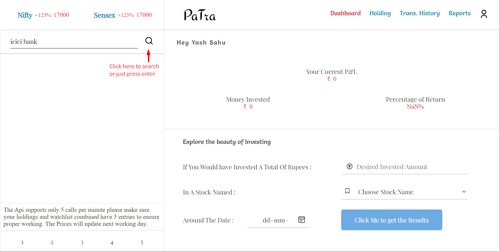
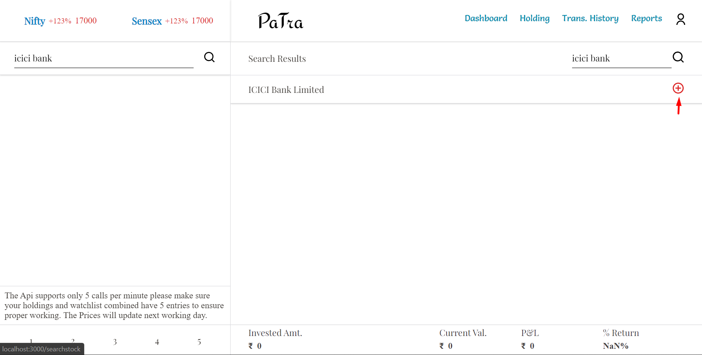

PaTra - A Paper Trading Platform

PaTra is a paper trading platform. One can use it to calculate the returns generated by the change in share price over previous years and can also experience the real market fluctuations by owning the shares using their own virtual money provided by the platform.

It is simulaiton of Indian stock Markets with real data fetched from Alpha Vantage Api.

This app is Deployed on Heroku Go Check it out

Link -->> https://patra-webapplication.herokuapp.com/

You Will Be -- 

--> Will Be Given 10 Lakh Virtual Money for Trading after registering.

--> Will Be Able to Buy and Sell Stocks ( With-out Brokerage 😜 )

--> Will Be Able to Solve your Question that -- " What Would have happened if I had bought ABC Share before 5 years or 10 years".

--> Will Be Able to see records for the transactions made by you.

--> Will Be Able to get Reports generated by the platform for a trade made by you.

Technical Details -- 
Some key Features of project Patra
--> Accomplished Responsiveness using CSS.
--> Retrieved Real Market Data using Alpha Vantage API.
--> Beautiful Animation using React-reveal, CSS Animations, and Lottie Flies.
--> State Management using Redux.
--> CRUD Operations using RESTFUL API created with the help of Node And Express.
--> Secure login and Hashed Password using JWT tokens & Bcrypt.js.
--> Installable Progresses web app using customized service worker, workbox, and web push.
--> Data Stored in MonogoDB Atlas.

Landing Page

Sign Up Page

Login Page

Dashboard

Here you can have a quick view about the performace of your investments

To Buy or Sell A stock that stock should be added to the watchlist 
search for a stock form the input bar just above the watchlist

Click on Buy icon to buy a Stock

Note -- You can-not short sell a stock here since these platform is made for long term investors

