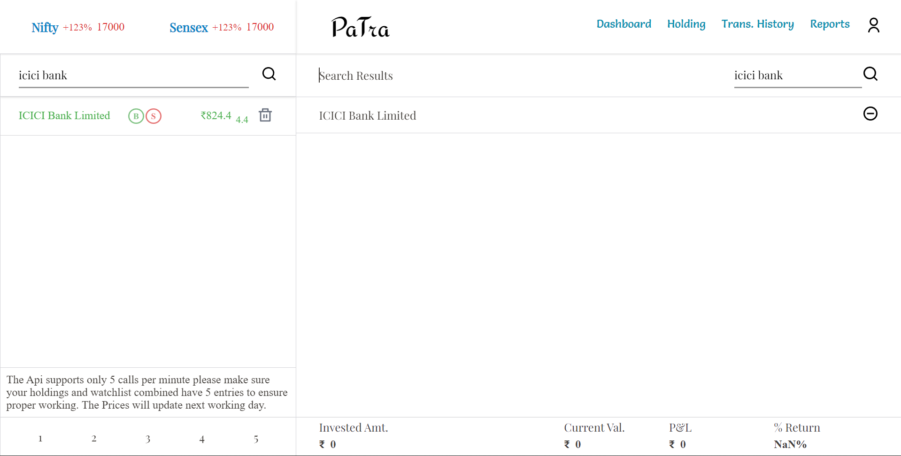
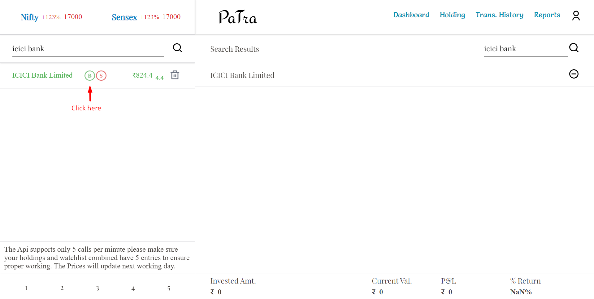
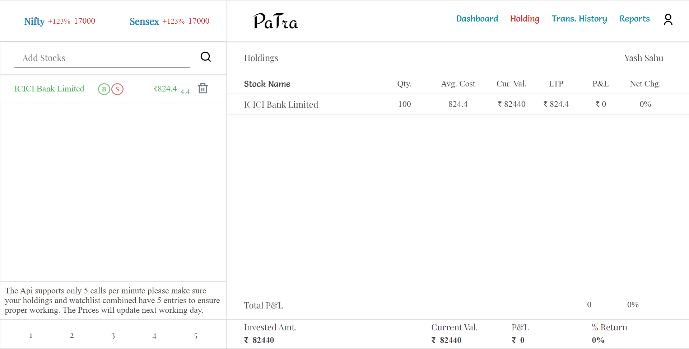
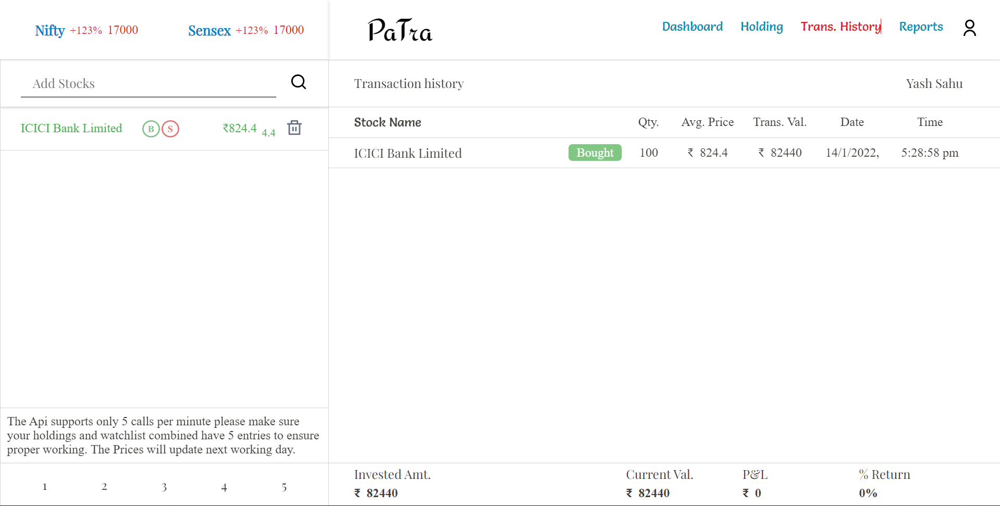
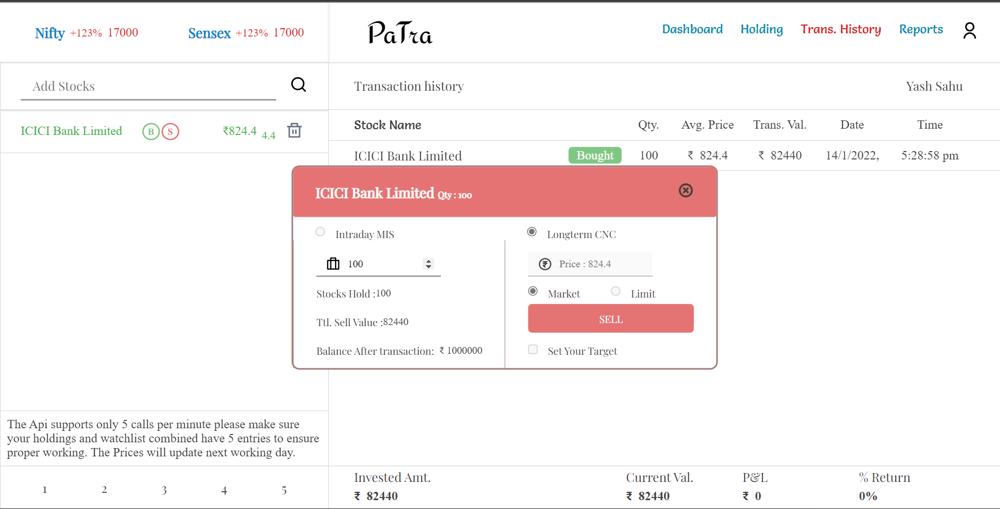
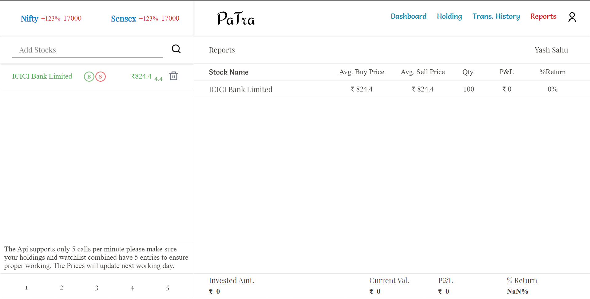
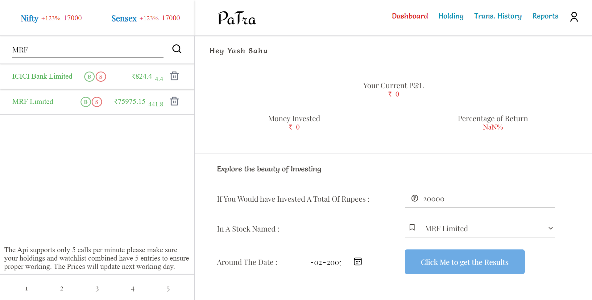
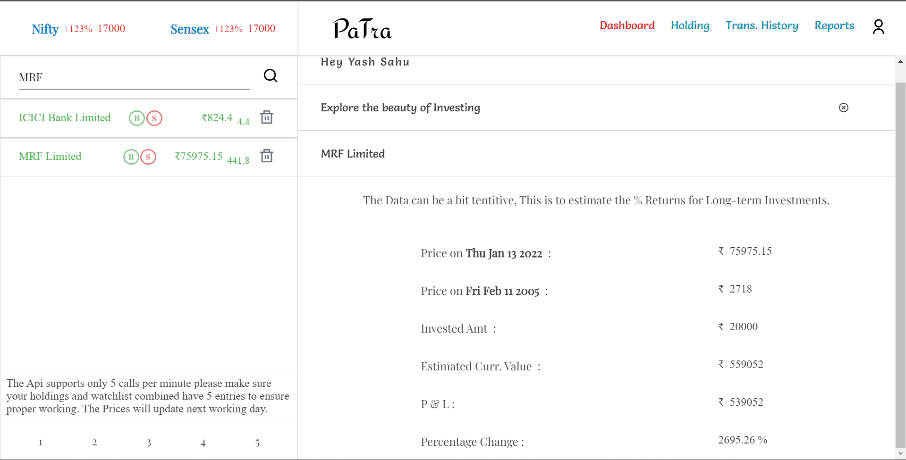
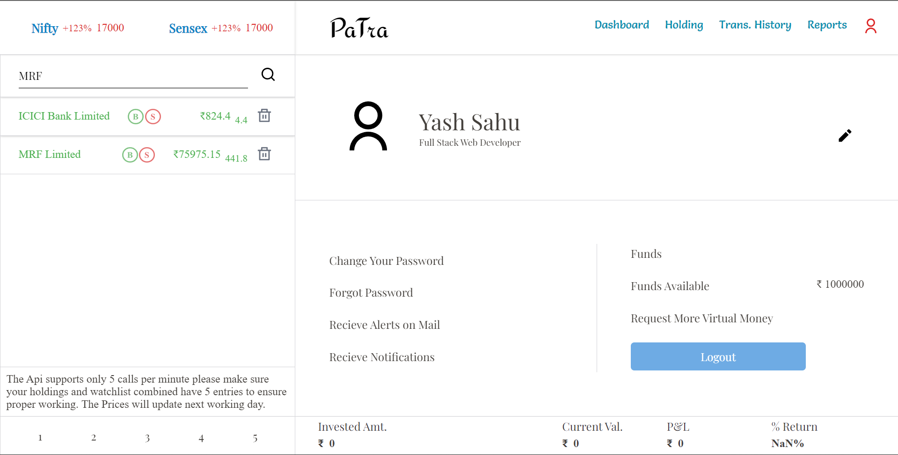

PaTra - A Paper Trading Platform

PaTra is a paper trading platform. One can use it to calculate the returns generated by the change in share price over previous years and can also experience the real market fluctuations by owning the shares using their own virtual money provided by the platform.

It is simulaiton of Indian stock Markets with real data fetched from Alpha Vantage Api.

This app is Deployed on Heroku Go Check it out

Link -->> https://patra-web.vercel.app/

 
 

You Will Be -- 

--> Will Be Given 10 Lakh Virtual Money for Trading after registering.

--> Will Be Able to Buy and Sell Stocks ( With-out Brokerage 😜 )

--> Will Be Able to Solve your Question that -- " What Would have happened if I had bought ABC Share before 5 years or 10 years".

--> Will Be Able to see records for the transactions made by you.

--> Will Be Able to get Reports generated by the platform for a trade made by you.

 
 

Technical Details -- 

Some key Features of project Patra

--> Accomplished Responsiveness using CSS.

--> Retrieved Real Market Data using Alpha Vantage API.

--> Beautiful Animation using React-reveal, CSS Animations, and Lottie Flies.

--> State Management using Redux.

--> CRUD Operations using RESTFUL API created with the help of Node And Express.

--> Secure login and Hashed Password using JWT tokens & Bcrypt.js.

--> Installable Progresses web app using customized service worker, workbox, and web push.

--> Data Stored in MonogoDB Atlas.
 
 
 
 

Guide Tutorial and Screenshots of the platform

Landing Page

Sign Up Page

Login Page

Dashboard

Here you can have a quick view about the performace of your investments

To Buy or Sell A stock that stock should be added to the watchlist 
search for a stock form the input bar just above the watchlist

Click on Buy icon to buy a Stock

Note -- You can-not short sell a stock here since these platform is made for long term investors

Transaction Dialog Box 

Note -- You will ONLY be able to place Market Orders Currently

Your Bought Share will be added to your holding and this transaction will be added to the transactions

Well what is Reports then ???

Reports are generated at the time when you completely square off from a position in a particular share or we say when you sell all the share holded belonging to a company

Well lets generate a report now 

so lets sell all the shares we just bought

Report Generated for our transaction is -->

Now lets us see what feature does the dashboard has for us --- "Explore the beauty of Investing"

lets bring your imagination to real and try to find out the what would had happend if you had invested 

What Would Have happed it you had invested 20,000 ( 20k ) Rupees in MRF Shares.

Note -- this will calculate the % Return generated by only change in price. Share Bonus and Split is not included here.

To calculate the % Return we first need to add that stock to the watchlist to lets Find out % Return generated by MRF share from feburary, 2005 .

Here we are taking MRF because it has not given any bonus or split in its due course

Now Let us see the rough estimate of current value 

Ans is -- 20,000 rupees in feb,2005 will be 5,59,052 rupees on jan,2022 

User Info Page of Patra 

